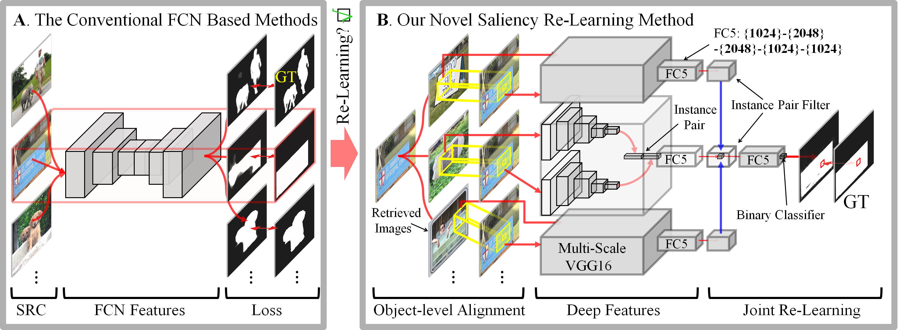

# Salient Object Detection via Multiple Instance Joint Re-Learning

### Pipeline



### Installation

*This model is tested on Windows10, CUDA 8.0, cuDNN 5.0

1. Clone the TMM_MIR repository, and we'll call the directory that you cloned as TMM_MIR-master.

2. Please install [Caffe](https://github.com/microsoft/caffe) first. I think you may find a great number of tutorials talking about how to install it.

### Usage

1. Please download our pretrained model at [Google Drive](https://drive.google.com/open?id=1HhHftSK8FPSYTBKn1AcrXrx-4HAyqEv5).   
   Put this model in `./models/` and `./reimg/`.

2. Run:

   ```shell
   main.m'
   ```

3. Apply CRF to do the post-processing for each image.   
   The code for CRF can be found in [Andrew-Qibin](https://github.com/Andrew-Qibin/dss_crf)   
   *Note that please provide a link to the original code as a footnote or a citation if you plan to use it.
   
### Other Saliency Method

1. [DSS](https://github.com/Andrew-Qibin/DSS): Deeply Supervised Salient Object Detection with Short Connections.

2. [MDF](https://i.cs.hku.hk/~gbli/deep_saliency.html): Deep Learning based Salient Object Detection.

3. [RFCN](https://pan.baidu.com/s/1XGhct3zvYIRKPafx2yAL-Q): Salient Object Detection with Recurrent Fully Convolutional Networks.

4. [RADF](https://github.com/xw-hu/RADF): Recurrently Aggregating Deep Features for Salient Object Detection.

5. [BRN](https://github.com/TiantianWang/CVPR18_detect_globally_refine_locally): Refine Locally: A Novel Approach to Saliency Detection.

6. [SRM](https://github.com/TiantianWang/ICCV17_SRM): A Stagewise Refinement Model for Detecting Salient Objects in Images

7. [PAGRN](https://github.com/zhangxiaoning666/PAGR): Progressive Attention Guided Recurrent Network for Salient Object Detection.
   
### Useful Links

1. [DUTS-TR-5K](https://drive.google.com/open?id=1HhHftSK8FPSYTBKn1AcrXrx-4HAyqEv5): including 5000 training. The source images can be found [here](http://saliencydetection.net/duts/).

2. [DeepLearnToolbox](https://github.com/rasmusbergpalm/DeepLearnToolbox): Matlab/Octave toolbox for deep learning.

3. [Edges](https://github.com/pdollar/edges): Structured Edge Detection Toolbox.

4. [matconvnet](https://github.com/vlfeat/matconvnet): CNNs for MATLAB.

5. [SIFT Flow](https://people.csail.mit.edu/celiu/SIFTflow/): Dense Correspondence across Scenes and its Applications.


